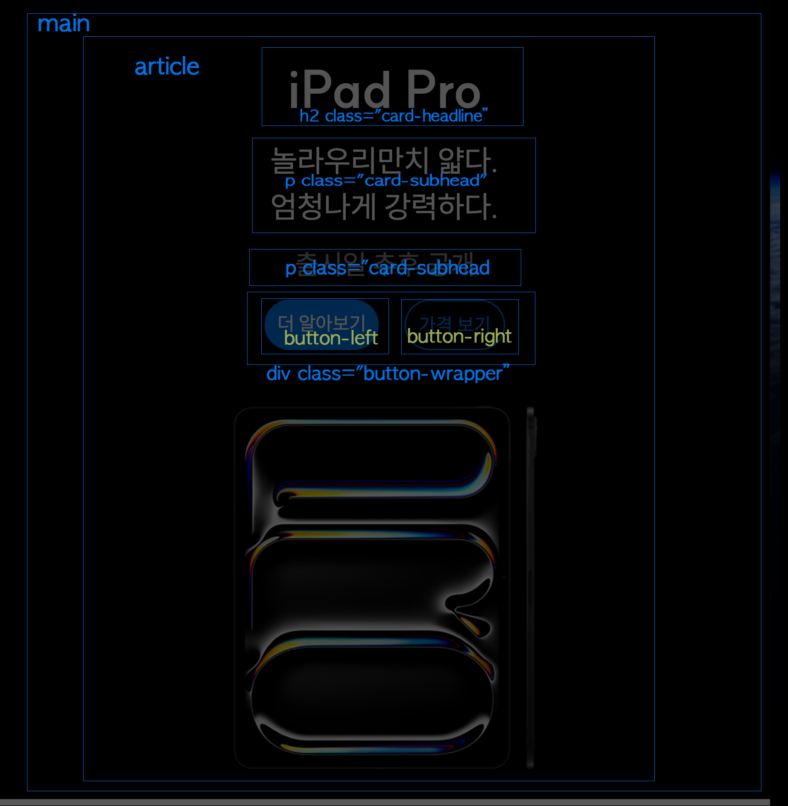

# 🟢 Introduction

- 과제: Apple 메인 페이지 구현
- 날짜: 2024년 10월 20일

# 🟢 Table of Contents

1. [마크업](#-마크업)
2. [HTML](#-html에-대하여)
3. [CSS](#-css-설명)
4. [결과](#-결과)
5. [문제점 및 구현 과정에서의 어려움](#-문제점-및-구현-과정에서의-어려움)
6. [과제를 마치며..](#-과제를-마치며)
   <br />
   <br />

## 🧐 마크업


<br>

```
 <article class="card card-black ipod-pro">
        <h2 class="card-headline">iPad Pro</h2>
        <p class="card-subhead">놀라우리만치 얇다.<br />엄청나게 강력하다.</p>
        <p class="card-subhead2">출시일 추후 공개</p>
        <div class="button-wrapper">
          <a role="button" class="button button-blue button-left" href="https://www.apple.com/kr/ipad" aria-label="아이패드 프로 더 알아보기">더 알아보기</a>
          <a role="button" class="button button-blue button-right" href="https://www.apple.com/kr/shop/buy-ipad" aria-label="아이패드 프로 가격 보기">가격 보기</a>
        </div>
      </article>
```

<br><br>

## 🏘️ HTML

1. ``article`태그를 사용
각각의 카드는 같은 스타일의 디자인이지만 다른 내용으로 일종의 기사와 같은 형태를 띠고 있고 있다 생각했다. 그래서 div 대신 `article``` 태그를 사용했다.

2. 제품의 이름은 컨포넌트 관점에서 가장 중요하다고 생각했기에 `h2`를 사용했다.

3. 제품의 설명은 부제목이라 하기엔 그 다음에 나올 내용이 없어 `p`태그를 사용했다.

4. button 컴포넌트는 `<a>`요소로 마크업했다. 처음엔 `<button>`으로 구상해봤는데 이 버튼은 단순 링크를 연결해주는 버튼인데 이 기능이 접근성 측면에서 적합한가를 고민하며 인터넷을 검색하다가 유튜브 ['AOA11y 채널'](https://www.youtube.com/watch?v=dhsr2LGTA-s)의 영상을 참고하여 최종적으로 `<a>`요소로 마크업을 진행했다.

---

<br />
<br />

## 🛋️ CSS

1. 카드 컴포넌트

- **flexbox로 구현**
- card 클래스: 카드 컴포넌트의 공통 스타일.
- card-black, card-whit 클래스: 카드 배경에 따른 두가지 타입의 스타일.

2. 버튼 컴포넌트

- button 클래스: 버튼 컴포넌트의 공통 스타일.
- button-blue, button-black 클래스: 버튼 컴포넌트의 두가지 색상 타입의 스타일.
- button-left, button-right 클래스: 버튼의 background-color, border-color 등의 스타일 차이에 따른 두가지 타입.

### 레이아웃

- #### Grid 및 반응형

  - **모바일(Small Screen) 퍼스트** 구현 후 **@media 규칙**을 통해 **데스크탑(Large Screen) 환경**의 **필요한 부분만** 스타일 재정의.

  - grid를 사용하여 세로로 1열로 배치하고, 데스크탑 환경에서 배치(2열) 및 background-image 변경.

---

<br />
<br />

## 🌈 결과

- 1024px 이하 Small Screen
  

- 1024px 이상 Large Screen


- 1024px 이상 X-Large Screen


  <br />
  <br />

---

<br />
<br />

## 💦 문제점 및 구현 과정에서의 어려움

---

<br />
<br />

## 🙂 과제를 마치며..

---

<br />
<br />
